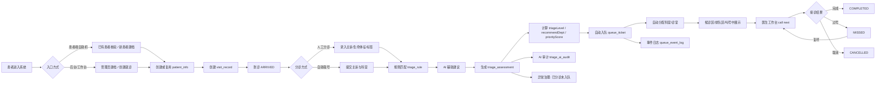
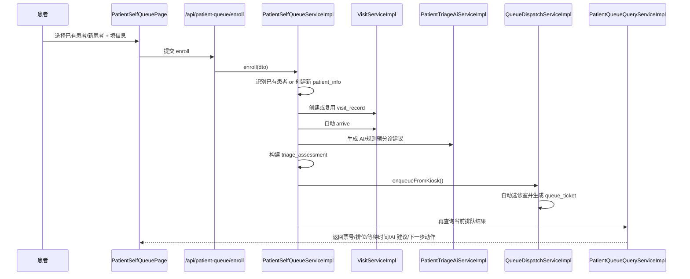
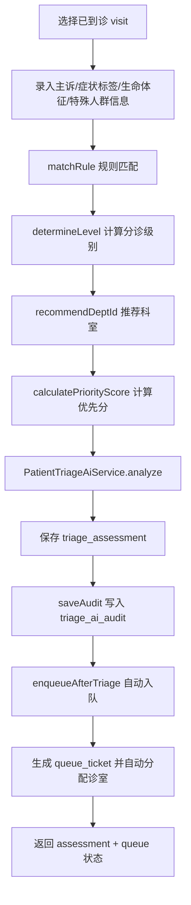
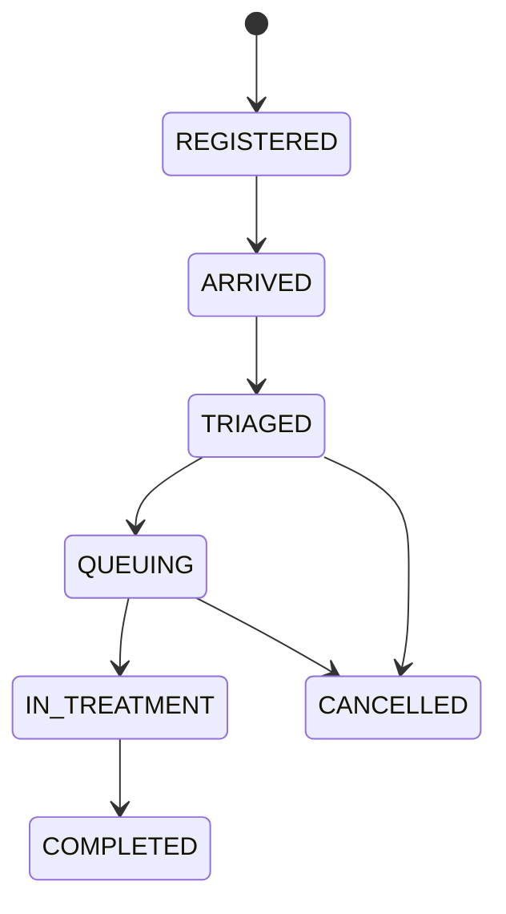
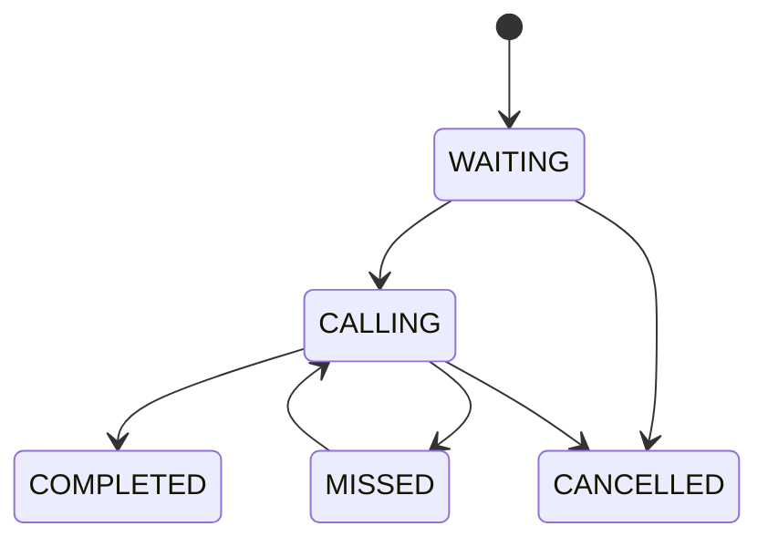

# 患者智能排队分诊系统源码流程图

## 1. 文档目的

这份文档用于把项目的“业务流程”和“源码实现”对齐说明清楚，帮助你快速回答下面几类问题：

- 这个项目到底是如何体现“患者智能排队分诊系统”的
- 患者从进入系统到完成接诊，主链路如何闭环
- AI、规则、排队、叫号、屏显分别在哪些代码里实现
- 如果要演示、答辩或排查问题，应该优先看哪些类和页面

项目核心定位不是单一的“挂号页面”或“排队列表”，而是把下面这条业务主链路打通：

`患者建档 / 患者识别 -> 本次就诊 visit -> 到诊 -> 分诊评估 -> 自动入队 -> 诊室叫号 -> 完成接诊`

对应说明可参考：

- `README.md`
- `docs/项目面试5分钟演示稿.md`

---

## 2. 全局业务闭环图

这张图体现了项目的三个核心特点：

1. 患者入口有两条，但后续会收敛到同一套 `visit -> assessment -> queue_ticket` 主链路。
2. AI 不是孤立功能，而是嵌在分诊环节里，既能辅助人工分诊，也能辅助自助取号。
3. 排队不是静态列表，而是接着进入“候诊、叫号、过号、复呼、完成”的状态流转体系。

---

## 3. 两条核心入口链路

## 3.1 患者自助取号主链路

患者端公开路由：

- `web/src/router/index.ts:275` -> `/patient/self-queue`
- `web/src/views/patient/PatientSelfQueuePage.vue`

页面上已经明确写出它支持两种模式：

- 已有患者直接取号
- 新患者先建档再取号

关键页面位置：

- `web/src/views/patient/PatientSelfQueuePage.vue:8`
- `web/src/views/patient/PatientSelfQueuePage.vue:45`
- `web/src/views/patient/PatientSelfQueuePage.vue:187`
- `web/src/views/patient/PatientSelfQueuePage.vue:314`

后端入口：

- `src/main/java/com/hospital/triage/modules/patient/controller/PatientQueueController.java`
- `POST /api/patient-queue/enroll`

核心服务：

- `src/main/java/com/hospital/triage/modules/patient/service/impl/PatientSelfQueueServiceImpl.java:83`

自助取号源码流程如下：

这一段代码的关键实现点：

- `resolveOrCreateNewPatient`：新患者建档  
  `src/main/java/com/hospital/triage/modules/patient/service/impl/PatientSelfQueueServiceImpl.java:155`
- `resolveExistingPatient`：已有患者核验  
  `src/main/java/com/hospital/triage/modules/patient/service/impl/PatientSelfQueueServiceImpl.java:190`
- `resolveOrCreateVisit`：创建本次就诊并自动到诊  
  `src/main/java/com/hospital/triage/modules/patient/service/impl/PatientSelfQueueServiceImpl.java:293`
- `buildSelfQueueAiRequest`：构造 AI 输入  
  `src/main/java/com/hospital/triage/modules/patient/service/impl/PatientSelfQueueServiceImpl.java:382`
- `buildKioskAssessment`：把 AI/规则结果固化为分诊记录  
  `src/main/java/com/hospital/triage/modules/patient/service/impl/PatientSelfQueueServiceImpl.java:336`
- `enqueueFromKiosk`：生成排队票据并自动选诊室  
  `src/main/java/com/hospital/triage/modules/queue/service/impl/QueueDispatchServiceImpl.java:120`

这一条链路体现了“智能排队分诊”的第一个关键点：

患者端不只是“登记信息”，而是能在一个页面内完成：

- 身份识别
- 建档
- 本次就诊创建
- AI 预分诊
- 自动入队
- 返回排队结果和下一步行动提示

---

## 3.2 人工分诊主链路

工作台/后台入口：

- `web/src/router/index.ts:120` -> `/admin/triage/assessments/new`
- `web/src/router/index.ts:213` -> `/workstation/triage/assessments/new`
- `web/src/views/triage/TriageAssessmentCreatePage.vue`

页面文案已经说明：提交后系统会计算分诊等级、推荐科室和优先分，并尝试自动入队。

关键页面位置：

- `web/src/views/triage/TriageAssessmentCreatePage.vue:9`
- `web/src/views/triage/TriageAssessmentCreatePage.vue:147`
- `web/src/views/triage/TriageAssessmentCreatePage.vue:167`
- `web/src/views/triage/TriageAssessmentCreatePage.vue:354`

后端入口：

- `src/main/java/com/hospital/triage/modules/triage/controller/TriageController.java`
- `POST /api/triage/assessments`

核心服务：

- `src/main/java/com/hospital/triage/modules/triage/service/impl/TriageAssessmentServiceImpl.java:68`

人工分诊流程如下：

关键源码定位：

- `create`：首次分诊  
  `src/main/java/com/hospital/triage/modules/triage/service/impl/TriageAssessmentServiceImpl.java:68`
- `reassess`：重评估  
  `src/main/java/com/hospital/triage/modules/triage/service/impl/TriageAssessmentServiceImpl.java:110`
- `calculatePriorityScore`：优先分计算  
  `src/main/java/com/hospital/triage/modules/triage/service/impl/TriageAssessmentServiceImpl.java:144`
- `recommendDeptId`：推荐科室  
  `src/main/java/com/hospital/triage/modules/triage/service/impl/TriageAssessmentServiceImpl.java:196`
- `matchRule`：规则匹配  
  `src/main/java/com/hospital/triage/modules/triage/service/impl/TriageAssessmentServiceImpl.java:250`
- `applyAiSuggestion`：写入 AI 建议结果  
  `src/main/java/com/hospital/triage/modules/triage/service/impl/TriageAssessmentServiceImpl.java:341`
- `updateVisitAfterAssessment`：更新 visit 状态  
  `src/main/java/com/hospital/triage/modules/triage/service/impl/TriageAssessmentServiceImpl.java:390`

这一条链路体现了“智能排队分诊”的第二个关键点：

人工分诊不是分诊完就结束，而是会立即联动排队系统自动入队，避免“分诊”和“候诊”是两套断开的系统。

---

## 4. 智能分诊是如何实现的

## 4.1 规则库驱动

数据库表：

- `src/main/resources/db/schema.sql:42` -> `triage_rule`

规则表里保存：

- `rule_code`
- `rule_name`
- `symptom_keyword`
- `triage_level`
- `recommend_dept_id`
- `special_weight`
- `fast_track`

规则维护页：

- `web/src/views/triage/TriageRulePage.vue:3`
- `web/src/views/triage/TriageRulePage.vue:60`

规则服务：

- `src/main/java/com/hospital/triage/modules/triage/service/impl/TriageRuleServiceImpl.java:26`
- `src/main/java/com/hospital/triage/modules/triage/service/impl/TriageRuleServiceImpl.java:32`

这表示系统的分诊逻辑不是写死在页面里，而是可配置、可维护、可运营的。

## 4.2 规则匹配优先级

规则匹配支持类：

- `src/main/java/com/hospital/triage/modules/triage/service/support/TriageRuleMatchSupport.java:19`
- `src/main/java/com/hospital/triage/modules/triage/service/support/TriageRuleMatchSupport.java:26`
- `src/main/java/com/hospital/triage/modules/triage/service/support/TriageRuleMatchSupport.java:35`

匹配排序逻辑是：

1. `triageLevel` 越高优先级越高
2. 命中的关键词越具体越优先
3. `specialWeight` 越高越优先
4. 最后再按 `id`

这意味着系统不仅能“识别症状”，还能尽量命中更具体的规则，而不是被笼统词条抢走。

## 4.3 AI 只是辅助层，不会阻断主链路

AI 服务：

- `src/main/java/com/hospital/triage/modules/triage/service/impl/PatientTriageAiServiceImpl.java:62`

关键能力点：

- `loadEnabledRules`：先加载本地规则  
  `src/main/java/com/hospital/triage/modules/triage/service/impl/PatientTriageAiServiceImpl.java:655`
- `buildRuleFallback`：先得到规则兜底结果  
  `src/main/java/com/hospital/triage/modules/triage/service/impl/PatientTriageAiServiceImpl.java:305`
- `mergeAiResult`：外部 AI 可用时再融合 AI 结果  
  `src/main/java/com/hospital/triage/modules/triage/service/impl/PatientTriageAiServiceImpl.java:246`
- `saveAudit`：把 AI 建议、请求、响应、最终采纳结果落审计表  
  `src/main/java/com/hospital/triage/modules/triage/service/impl/PatientTriageAiServiceImpl.java:117`
- `shouldManualReview`：高风险场景要求人工复核  
  `src/main/java/com/hospital/triage/modules/triage/service/impl/PatientTriageAiServiceImpl.java:565`

AI 审计表：

- `src/main/resources/db/schema.sql:100` -> `triage_ai_audit`

这体现出第三个“智能点”：

AI 的定位是“辅助建议层”，不是“唯一判断源”。即使外部模型不可用，系统仍然能靠规则兜底把流程跑完。

---

## 5. 智能排队是如何实现的

## 5.1 自动入队

队列控制器：

- `src/main/java/com/hospital/triage/modules/queue/controller/QueueController.java`

队列核心服务：

- `src/main/java/com/hospital/triage/modules/queue/service/impl/QueueDispatchServiceImpl.java`

关键方法：

- `enqueueAfterTriage`：人工分诊后自动入队  
  `src/main/java/com/hospital/triage/modules/queue/service/impl/QueueDispatchServiceImpl.java:113`
- `enqueueFromKiosk`：自助取号后自动入队  
  `src/main/java/com/hospital/triage/modules/queue/service/impl/QueueDispatchServiceImpl.java:120`
- `upsertTicket`：生成或刷新当前有效排队票据  
  `src/main/java/com/hospital/triage/modules/queue/service/impl/QueueDispatchServiceImpl.java:442`

排队票据表：

- `src/main/resources/db/schema.sql:159` -> `queue_ticket`

关键字段：

- `ticket_no`
- `visit_id`
- `assessment_id`
- `dept_id`
- `room_id`
- `triage_level`
- `priority_score`
- `status`
- `room_assignment_status`

## 5.2 优先分不是静态数字，而是动态策略

优先分计算来源分成两层：

第一层是分诊时的基础优先分：

- 分诊级别
- 规则权重
- 特殊人群
- 等待老化补偿
- 人工加权

实现：

- `src/main/java/com/hospital/triage/modules/triage/service/impl/TriageAssessmentServiceImpl.java:144`

第二层是排队时的实时排序分：

- `calculateQueueScore`  
  `src/main/java/com/hospital/triage/modules/queue/service/impl/QueueDispatchServiceImpl.java:319`
- `buildPriorityContext`  
  `src/main/java/com/hospital/triage/modules/queue/service/impl/QueueDispatchServiceImpl.java:334`

这里又叠加了：

- 等待时长老化补偿
- 高峰期策略 `surge`
- 快速通道 `fast_track`
- 高优先级患者加权

策略配置统一放在：

- `src/main/java/com/hospital/triage/modules/queue/service/impl/AppQueueProperties.java`

典型配置项：

- `recallLimit`
- `agingScorePerMinute`
- `callNextRetryTimes`
- `callingTtlSeconds`
- `surgeWaitingThreshold`
- `surgePriorityBonus`
- `surgeFastTrackBonus`

## 5.3 自动分配诊室

诊室分配不是纯手工，而是会在入队时自动挑选诊室：

- `pickRoomIdForKiosk`  
  `src/main/java/com/hospital/triage/modules/queue/service/impl/QueueDispatchServiceImpl.java:616`
- `resolveRoomAssignmentStatus`  
  `src/main/java/com/hospital/triage/modules/queue/service/impl/QueueDispatchServiceImpl.java:750`

这意味着患者在进入队列时，不仅会知道属于哪个科室，还会尽可能拿到具体诊室。

## 5.4 实时叫号使用 Redis + Lua，避免并发混乱

Redis 键定义：

- `src/main/java/com/hospital/triage/common/constant/RedisKeyConstants.java`

包括：

- `queue:dept:%s:active`
- `queue:room:%s:active`
- `queue:calling:%s`
- `queue:seq:%s:%s`

Redis 配置：

- `src/main/java/com/hospital/triage/config/RedisConfig.java`

Lua 脚本：

- `src/main/resources/scripts/queue/call-next.lua`

脚本会原子完成：

1. 检查当前诊室是否已有人在叫号
2. 从诊室队列里取队首
3. 必要时从 overflow 队列回退
4. 写入当前 `callingKey`

这说明该项目的“叫号”考虑了实时并发，而不是简单查数据库后更新状态。

---

## 6. 状态机设计

## 6.1 就诊状态流转

`visit_record.status` 是就诊全流程主状态。

相关实现：

- 创建就诊  
  `src/main/java/com/hospital/triage/modules/visit/service/impl/VisitServiceImpl.java:38`
- 到诊  
  `src/main/java/com/hospital/triage/modules/visit/service/impl/VisitServiceImpl.java:65`
- 分诊后更新为 `TRIAGED`  
  `src/main/java/com/hospital/triage/modules/triage/service/impl/TriageAssessmentServiceImpl.java:390`
- 叫号后更新为 `IN_TREATMENT`  
  `src/main/java/com/hospital/triage/modules/queue/service/impl/QueueDispatchServiceImpl.java:180`

## 6.2 队列状态流转

`queue_ticket.status` 体现候诊队列本身的状态。

关键方法：

- `callNext`  
  `src/main/java/com/hospital/triage/modules/queue/service/impl/QueueDispatchServiceImpl.java:180`
- `recall`  
  `src/main/java/com/hospital/triage/modules/queue/service/impl/QueueDispatchServiceImpl.java`
- `markMissed`  
  `src/main/java/com/hospital/triage/modules/queue/service/impl/QueueDispatchServiceImpl.java`
- `complete`  
  `src/main/java/com/hospital/triage/modules/queue/service/impl/QueueDispatchServiceImpl.java`
- `cancel`  
  `src/main/java/com/hospital/triage/modules/queue/service/impl/QueueDispatchServiceImpl.java`

## 6.3 前端显示状态再细分为“候诊中”和“排队中”

前端工具：

- `web/src/utils/queueStatus.ts`

这里把原始 `WAITING` 再拆成两种展示语义：

- `WAITING_FOR_CONSULTATION`：候诊中
- `QUEUEING`：排队中

相关引用：

- `web/src/views/queues/QueueCallPage.vue`
- `web/src/views/screens/DeptScreenPage.vue`

这就是为什么大屏和工作台能把“已经到诊室门口候诊”和“还在总队列里等待”区分开显示。

---

## 7. 四端如何协同体现系统能力

| 端 | 路由 | 主要职责 | 体现的系统能力 |
| --- | --- | --- | --- |
| 患者端 | `/patient/self-queue` | 建档、识别、自助取号 | 患者自助进入闭环 |
| 患者端 | `/patient/queue` | 查询排位、等待时间、下一步 | 患者可感知当前流程 |
| 工作台 | `/workstation/triage/assessments/new` | 人工分诊 | 规则 + AI 辅助分诊 |
| 工作台 | `/workstation/queue-call` | 叫号、复呼、过号、完成 | 排队状态机落地 |
| 管理端 | `/admin/*` | 患者、就诊、规则、异常、日志、看板 | 运营治理能力 |
| 屏显端 | `/screen/dept/:deptId` | 候诊区/排队区/叫号展示 | 现场实时展示能力 |

路由集中定义在：

- `web/src/router/index.ts`

其中关键路由位置：

- `web/src/router/index.ts:265` -> `/patient/queue`
- `web/src/router/index.ts:275` -> `/patient/self-queue`
- `web/src/router/index.ts:285` -> `/admin`
- `web/src/router/index.ts:291` -> `/workstation`
- `web/src/router/index.ts:297` -> `/screen`

---

## 8. 患者查询为什么不仅仅是“查排队”

患者查询入口：

- `web/src/views/patient/PatientQueuePage.vue:7`
- `src/main/java/com/hospital/triage/modules/patient/service/impl/PatientQueueQueryServiceImpl.java:58`

返回内容不仅包括：

- 当前票号
- 当前排位
- 前方人数
- 预计等待时间

还包括：

- 当前就诊状态
- 当前排队状态文案
- 科室和诊室
- AI 推荐科室
- AI 风险等级
- AI 建议说明
- 下一步行动指引 `nextStep`

关键实现：

- `buildView`  
  `src/main/java/com/hospital/triage/modules/patient/service/impl/PatientQueueQueryServiceImpl.java:165`
- `fillAiSuggestion`  
  `src/main/java/com/hospital/triage/modules/patient/service/impl/PatientQueueQueryServiceImpl.java:243`
- `buildNextStep`  
  `src/main/java/com/hospital/triage/modules/patient/service/impl/PatientQueueQueryServiceImpl.java:388`

这说明系统不是单纯让患者“看号”，而是在做患者流程引导。

---

## 9. 大屏为什么能体现“候诊区”和“排队区”

科室大屏页面：

- `web/src/views/screens/DeptScreenPage.vue`

页面核心显示逻辑：

- `consultationTickets`：候诊区
- `queueingTickets`：排队区
- `focusTickets`：优先关注患者
- `heroTicketData`：当前最重要的叫号/候诊焦点

关键位置：

- `web/src/views/screens/DeptScreenPage.vue:6`
- `web/src/views/screens/DeptScreenPage.vue:125`
- `web/src/views/screens/DeptScreenPage.vue:167`
- `web/src/views/screens/DeptScreenPage.vue:264`
- `web/src/views/screens/DeptScreenPage.vue:292`
- `web/src/views/screens/DeptScreenPage.vue:480`

这体现了项目的现场展示能力：

- 候诊区显示“已经靠近接诊”的患者
- 排队区显示“仍在等待队列”的患者
- 大屏会自动滚动和刷新
- 现场患者能更容易知道自己现在属于哪个阶段

---

## 10. 异常治理和运营能力

## 10.1 已分诊未入队异常

异常治理页：

- `web/src/views/queues/QueueExceptionPage.vue:4`

异常服务：

- `src/main/java/com/hospital/triage/modules/queue/service/impl/QueueExceptionServiceImpl.java:48`

它会找出：

- `visit_record.status = TRIAGED`
- 但没有有效 `WAITING / CALLING / MISSED` 队列票据

这说明系统考虑了真实医院场景下的断链问题，不是假设所有流程永远成功。

## 10.2 队列事件日志

事件日志页：

- `web/src/views/queues/QueueEventPage.vue:4`

事件服务：

- `src/main/java/com/hospital/triage/modules/queue/service/impl/QueueEventLogServiceImpl.java:25`

事件表：

- `src/main/resources/db/schema.sql:191` -> `queue_event_log`

系统会记录：

- 入队
- 叫号
- 复呼
- 过号
- 完成
- 取消
- 人工调整

这体现出系统具备可追踪、可审计、可回溯的运营能力。

## 10.3 管理看板

管理看板页：

- `web/src/views/dashboard/DashboardPage.vue`

服务：

- `src/main/java/com/hospital/triage/modules/dashboard/service/impl/DashboardServiceImpl.java:35`
- `src/main/java/com/hospital/triage/modules/dashboard/service/impl/DashboardServiceImpl.java:62`

会统计：

- 候诊人数
- 叫号人数
- 已完成人数
- 平均等待时间
- 高优先级超时人数
- 已分诊未入队异常数

这说明项目不仅关心“流程能跑通”，还关心“流程是否运行健康”。

---

## 11. 核心数据库实体一览

| 表名 | 作用 | 在系统中的位置 |
| --- | --- | --- |
| `patient_info` | 患者主档案与当前状态快照 | 患者建档、自助识别、当前状态回写 |
| `visit_record` | 一次具体就诊过程 | 挂号、到诊、分诊、接诊全链路主记录 |
| `triage_rule` | 分诊规则配置 | 规则匹配、后台规则维护 |
| `triage_assessment` | 分诊评估结果 | 分诊等级、推荐科室、优先分、AI 结果 |
| `triage_ai_audit` | AI 建议审计 | AI 请求/响应/采纳结果留痕 |
| `clinic_dept` | 科室主数据 | 推荐科室、路由、大屏范围 |
| `clinic_room` | 诊室主数据 | 自动分配诊室、工作台与屏显定位 |
| `queue_ticket` | 排队票据 | 排队、候诊、叫号、过号、完成 |
| `queue_event_log` | 队列事件流 | 运营审计、问题排查 |
| `sys_user` | 系统用户 | 管理员、医生登录与权限 |

表结构可直接查看：

- `src/main/resources/db/schema.sql`

---

## 12. 建议你演示这个项目时的讲法

如果你要对老师、面试官或项目组说明这个系统，可以按下面顺序讲：

1. 先讲问题：医院现场不是只有“排队”，而是“建档、到诊、分诊、入队、叫号”多环节断裂。
2. 再讲闭环：这个项目把患者端、工作台、管理端、大屏端全部串成一条链。
3. 再讲智能：规则匹配、AI 辅助、动态优先分、自动分诊室、实时叫号。
4. 最后讲工程性：Redis + Lua 保证并发叫号一致性，事件日志和异常治理保证系统可运营。

可以直接概括成一句话：

> 这个项目不是一个简单的排队页面，而是一个把“患者进入医院后如何被识别、分诊、入队、叫号和追踪”的完整业务系统。

---

## 13. 最值得优先阅读的源码文件

如果只想最快读懂整个项目，建议优先阅读这 10 个文件：

1. `src/main/java/com/hospital/triage/modules/patient/service/impl/PatientSelfQueueServiceImpl.java`
2. `src/main/java/com/hospital/triage/modules/triage/service/impl/TriageAssessmentServiceImpl.java`
3. `src/main/java/com/hospital/triage/modules/triage/service/impl/PatientTriageAiServiceImpl.java`
4. `src/main/java/com/hospital/triage/modules/triage/service/support/TriageRuleMatchSupport.java`
5. `src/main/java/com/hospital/triage/modules/queue/service/impl/QueueDispatchServiceImpl.java`
6. `src/main/java/com/hospital/triage/modules/patient/service/impl/PatientQueueQueryServiceImpl.java`
7. `src/main/java/com/hospital/triage/modules/queue/service/impl/QueueExceptionServiceImpl.java`
8. `web/src/views/patient/PatientSelfQueuePage.vue`
9. `web/src/views/queues/QueueCallPage.vue`
10. `web/src/views/screens/DeptScreenPage.vue`

---

## 14. 总结

这个项目之所以能体现“患者智能排队分诊系统”，本质上是因为它同时做到了四件事：

1. 做到了真实业务闭环：建档、到诊、分诊、入队、叫号、完成接诊全部连通。
2. 做到了智能辅助：规则匹配、AI 建议、动态优先分、自动分配诊室。
3. 做到了多端协同：患者端、工作台、管理端、屏显端共享同一套后端状态。
4. 做到了可运营：异常治理、事件日志、看板统计、规则可维护。

所以它不是“排队系统 + AI 按钮”的简单拼接，而是把医院门诊/急诊现场的核心流程真正系统化了。
